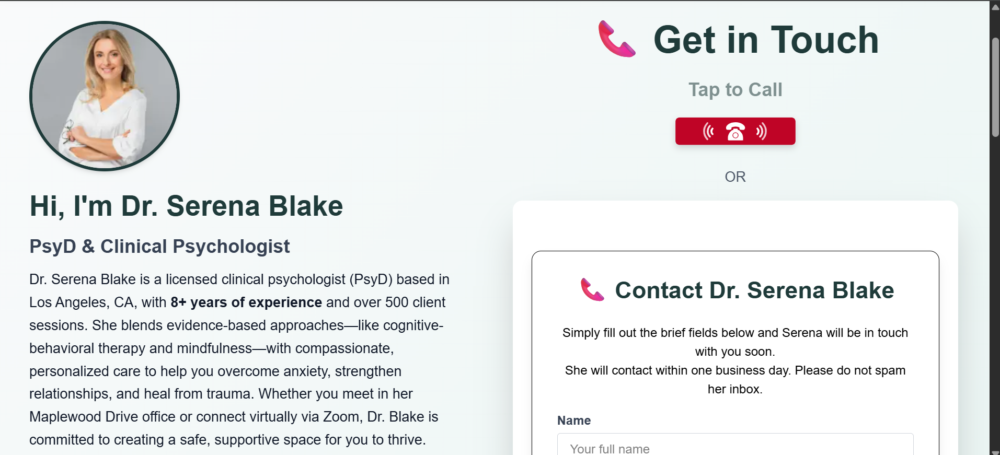

# 🧠 Therapist Website - Dr. Serena Blake, PsyD

A responsive and accessible website built with **Next.js 14 (App Router)** and **Tailwind CSS** for an imaginary therapist, **Dr. Serena Blake**. This project was completed as part of the internship assignment for Grow My Therapy.

## 🌐 Live Preview

👉 [View Live Website](https://therapist-website-eta.vercel.app/)

## 📂 Project Structure
- **Hero Section** – Clean headline, subheadline, CTA button
- **About Section** – Therapist bio, credentials, and animation
- **Services Section** – Clear descriptions with relevant images
- **FAQ Section** – Accordion-style common questions
- **Contact Section** – Form with ReCAPTCHA, validations & success message
- **Sticky Popup CTA** – Timed popup with animations and close logic

## 🛠️ Tech Stack
- ✅ **Next.js 14** – App Router
- ✅ **Tailwind CSS** – For responsive styling
- ✅ **TypeScript** – For type safety
- ✅ **Zod + React Hook Form** – Form validation
- ✅ **Google reCAPTCHA v2** – Bot protection
- ✅ **Lottie** – Animation in About section
- ✅ **Vercel** – Deployment

## 📸 Screenshots




## ✅ Features Implemented
- Fully responsive layout (mobile + desktop)
- Accessible navigation and form fields
- Realistic copywriting & alt texts
- Hover interactions & transitions
- Reusable components with clean structure
- Flash message on successful form submission
- Page-level SEO and meta tags

## 📥 How to Run Locally

```bash
git clone https://github.com/yourusername/therapist-website.git
cd therapist-website
npm install
npm run dev


// inbuild read me ignore it

This is a [Next.js](https://nextjs.org) project bootstrapped with [`create-next-app`](https://nextjs.org/docs/app/api-reference/cli/create-next-app).

## Getting Started

First, run the development server:

```bash
npm run dev
# or
yarn dev
# or
pnpm dev
# or
bun dev
```

Open [http://localhost:3000](http://localhost:3000) with your browser to see the result.

You can start editing the page by modifying `app/page.tsx`. The page auto-updates as you edit the file.

This project uses [`next/font`](https://nextjs.org/docs/app/building-your-application/optimizing/fonts) to automatically optimize and load [Geist](https://vercel.com/font), a new font family for Vercel.

## Learn More

To learn more about Next.js, take a look at the following resources:

- [Next.js Documentation](https://nextjs.org/docs) - learn about Next.js features and API.
- [Learn Next.js](https://nextjs.org/learn) - an interactive Next.js tutorial.

You can check out [the Next.js GitHub repository](https://github.com/vercel/next.js) - your feedback and contributions are welcome!

## Deploy on Vercel

The easiest way to deploy your Next.js app is to use the [Vercel Platform](https://vercel.com/new?utm_medium=default-template&filter=next.js&utm_source=create-next-app&utm_campaign=create-next-app-readme) from the creators of Next.js.

Check out our [Next.js deployment documentation](https://nextjs.org/docs/app/building-your-application/deploying) for more details.
